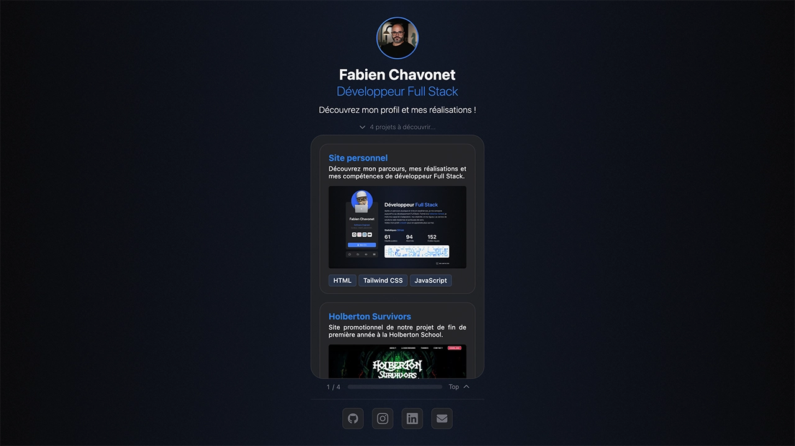
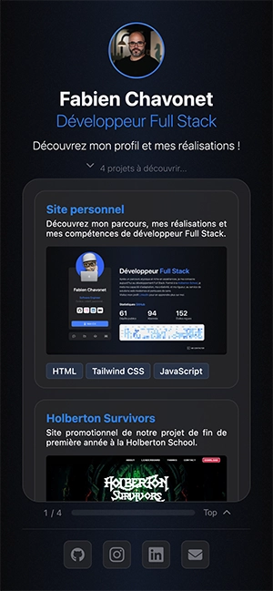

# Link Tree

## Description

This project is a custom link page inspired by platforms like [Linktree](https://linktr.ee/), designed to be used as a QR code landing page on my resume or business card.

It provides a fast and lightweight overview of my profile as a full stack developer, with quick access to my main projects, social media profiles, and contact details. 

Unlike a full portfolio website, this page is optimized for quick scanning and mobile viewing. Think of it as a curated snapshot of my work and skills, designed for recruiters or collaborators who want to get a first impression in just a few seconds.

## Objectives

- Provide a fast-loading, mobile-first web interface.
- Highlight personal projects with preview screenshots.
- Showcase professional profiles and contact links.
- Practice DOM manipulation, scroll events, and animations in vanilla JavaScript.- 
- Animate UI components on load and scroll to enhance user engagement.

## Tech Stack


## File Description

| **FILE**     | **DESCRIPTION**                                            |
| :----------: | ---------------------------------------------------------- |
| `assets`     | Contains the resources required for the repository.        |
| `index.html` | The main HTML structure of the project.                    |
| `style.css`  | Custom CSS styling for layout, animations, and design.     |
| `script.js`  | JavaScript behaviors for scroll indicators and animations. |
| `README.md`  | The README file you are currently reading 😉.              |

## Installation & Usage

### Installation

1. Clone this repository:
    - Open your preferred Terminal.
    - Navigate to the directory where you want to clone the repository.
    - Run the following command:

```
git clone https://github.com/fchavonet/full_stack-link_tree.git
```

2. Open the cloned repository.

### Usage

1. Open the `index.html` file in your web browser.

You can also test the project online by clicking [here](https://fchavonet.github.io/full_stack-link_tree/). 

<table>
    <tr>
        <th align="center" style="text-align: center;">Desktop view</th>
        <th align="center" style="text-align: center;">Mobile view</th>
    </tr>
    <tr valign="top">
        <td align="center">
            
        </td>
        <td align="center">
            
        </td>
    </tr>
</table>

## What's Next?

- Implement a lightweight CMS or JSON feed to update project data dynamically.
- Integrate basic analytics to track user engagement.

## Thanks

- A big thank you to my friends Pierre and Yoann, always available to test and provide feedback on my projects.

## Author(s)

**Fabien CHAVONET**
- GitHub: [@fchavonet](https://github.com/fchavonet)
